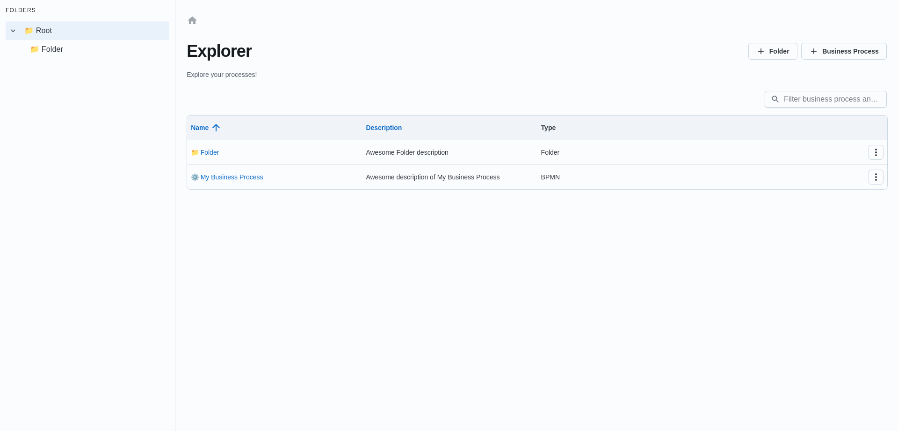
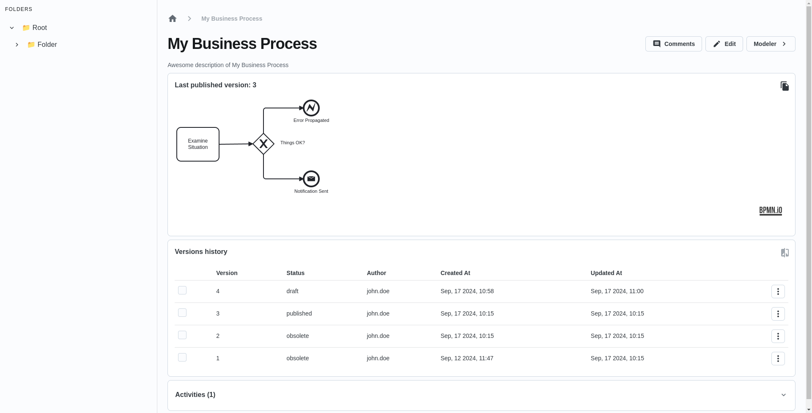
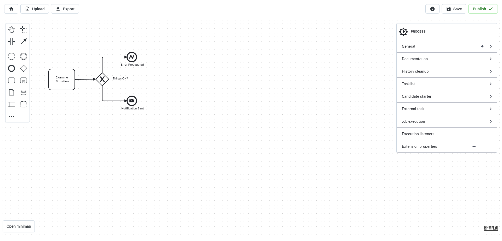
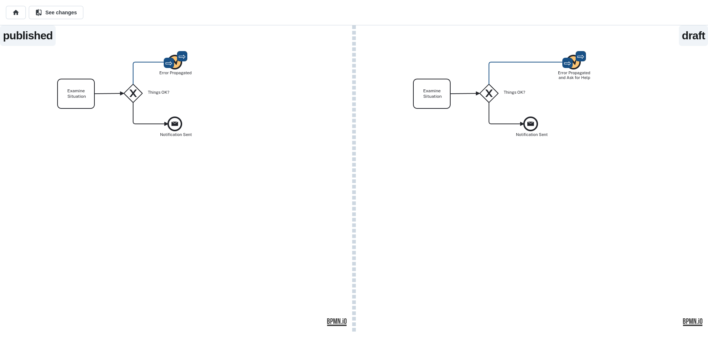

# BPMN Manager with bpmn-js

## Description

This project is a comprehensive BPMN (Business Process Model and Notation) diagram manager, designed to help users organize, sort, delete, and manage their BPMN models intuitively and efficiently. Built on the powerful [bpmn-js](https://bpmn.io/) library, our solution offers a user-friendly interface with additional features to simplify the management of BPMN diagrams in complex environments.

BPMN is a widely adopted standard for graphically representing business processes. However, as organizations handle numerous models, managing and organizing these diagrams can quickly become a challenge. This project aims to solve this issue by providing a centralized and easy-to-use platform for managing BPMN diagrams, with advanced sorting and management capabilities beyond the basic features offered by bpmn-js.

### Why Use This Tool?

- **Simplified Management**: Whether you're a business process architect, developer, or project manager, this tool allows you to easily visualize, organize, and manage your BPMN diagrams, significantly reducing time spent on administrative tasks.
- **Enhanced Organization**: With our advanced sorting and filtering options, you can quickly find relevant diagrams among a large number of models, sorting by name, creation date, or even specific metadata.
- **Batch Editing and Deletion**: The interface offers convenient features to edit or delete multiple diagrams in one operation, making large-scale management easy.
- **Seamless bpmn-js Integration**: As the underlying engine, bpmn-js ensures native compatibility with BPMN files, while benefiting from the optimizations we have developed.
- **Intuitive Interface**: The interface is designed to be accessible to users of all skill levels, with optimized ergonomics for daily use in complex environments.

### Use Cases

- **For Businesses**: Managing hundreds of business processes through BPMN diagrams can quickly become overwhelming. Our tool offers a centralized solution to organize business processes while making analysis, maintenance, and optimization easier.
- **For Development Teams**: Developers working on workflow management systems or process automation will find this tool useful for quickly managing and iterating on BPMN models.
- **For Digital Transformation Consultants**: When modeling processes for clients, this tool allows for centralized diagram management and ensures optimal tracking of business process evolution.

In summary, this tool is designed to improve efficiency in managing BPMN diagrams while offering a modern interface suited to the complexity of today's business environments.

## Features

- Self-hosted application
- Create folders and sub-folders to organize, build and import business process
- Manage, sort and filter business process and folders
- Import existing BPMN or export as .bpmn or .svg
- View, edit, clone and compare version histories with various status (published, draft or obsolete)
- Integration with the [bpmn-js](https://bpmn.io/) library.

## Getting started

```bash
# Clone the repository
$ git clone https://github.com/ovh/bpmn-tool.git
```

Then follow [backend README](./backend/README.md) and [frontend README](./frontend/README.md).

## Related links

- Contribute: https://github.com/ovh/bpmn-tool/blob/master/CONTRIBUTING.md
- Report bugs: https://github.com/ovh/bpmn-tool/issues

## Screenshots

|                                                                                                  |                                                                                                                       |
| ------------------------------------------------------------------------------------------------ | --------------------------------------------------------------------------------------------------------------------- |
| [](./docs/assets/bpmn-tool-root.png)          | [](./docs/assets/bpmn-tool-process-viewer.png) |
| [](./docs/assets/bpmn-tool-modeler.png) | [](./docs/assets/bpmn-tool-process-compare.png)      |

## License

This project is licensed under the Apache License 2.0 - see the [LICENSE](./LICENSE) file for details.

The main library used in this project is [bpmn-js](https://bpmn.io/) (see license [here](https://bpmn.io/license/)).

All dependencies licenses are listed in the [LICENSES](./LICENSES) folder.
